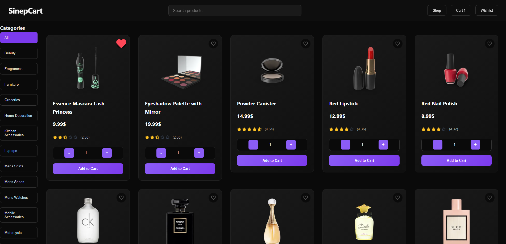
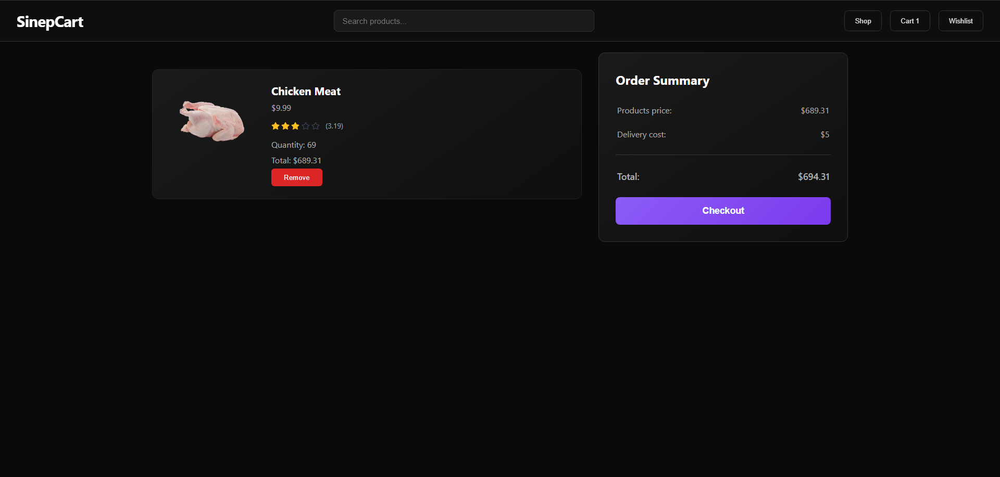
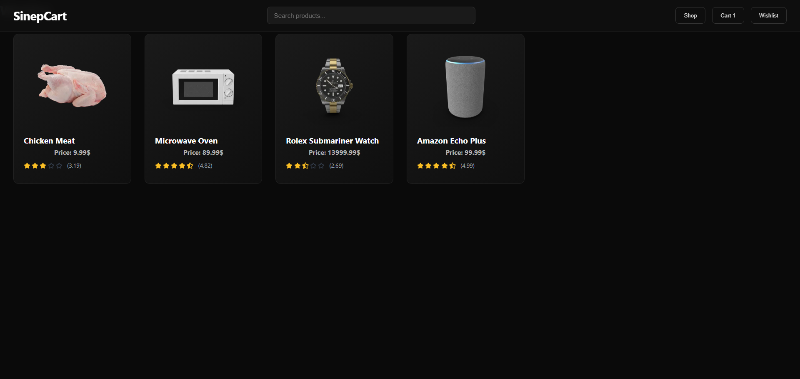
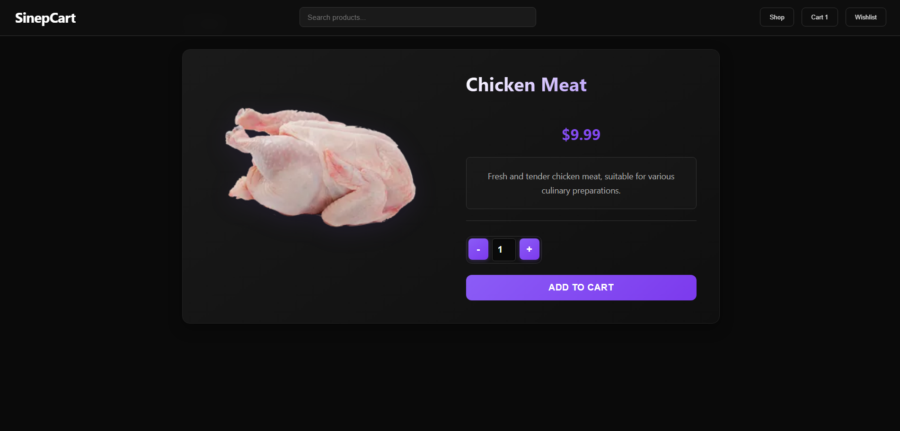

# 🛒 ReactShop

A fully functional shopping cart built with **React**.  
Users can browse products, filter them, add items to the cart, view details, and manage their wishlist — all in a clean and responsive UI.

---

## 🚀 Live Demo
👉 [ReactShop on Netlify](https://andreireactshop.netlify.app)

---

## ✨ Features
- 📦 **Product listing** – Displays all available products  
- 🔍 **Filtering** – Filter products by category  
- ❤️ **Wishlist** – Save favorite items  
- 🛒 **Shopping cart** – Add, remove, and update items  
- 📄 **Product details** – View detailed info for each product  
- 📱 **Responsive design** – Works on desktop and mobile  
- 📧 **Checkout with EmailJS** – Sends order confirmation  

---

[](https://andreireactshop.netlify.app/)
[](https://andreireactshop.netlify.app/shop)
[](https://andreireactshop.netlify.app/cart)
[](https://andreireactshop.netlify.app/wishlist)
[](https://andreireactshop.netlify.app/product/19)


---

## 🛠️ Tech Stack
- [React](https://react.dev/)  
- [React Router](https://reactrouter.com/)  
- [EmailJS](https://www.emailjs.com/)  
- [Vite](https://vitejs.dev/)  
- CSS (custom styling)

---

## ⚙️ Installation & Setup

Clone the repository:
```bash
git clone https://github.com/andrew-miroiu/ReactShop.git
cd ReactShop
